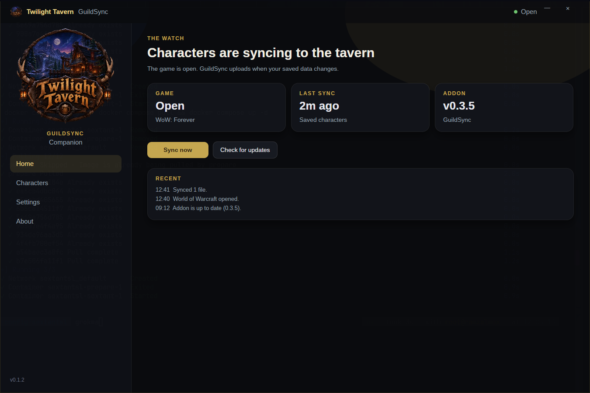
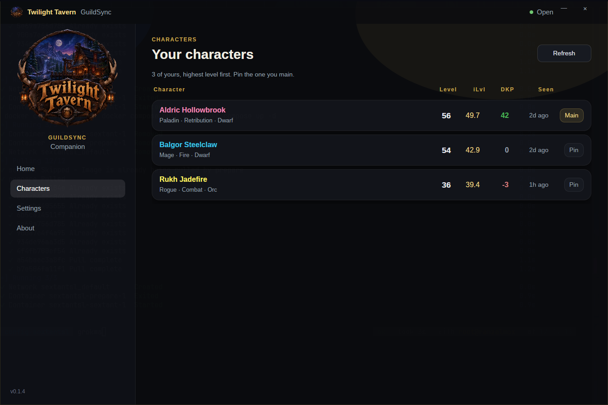

# GuildSync Companion



You play. We keep the character sheet up to date on [twilighttavern.co](https://twilighttavern.co).

The addon in-game writes a file called `GuildSync.lua`. This app uploads that file for you, so you can stop dragging it onto the website after every raid night.

Same idea as the [Linux tray app](https://forgejo.fifthdread.com/Fifthdread/guildsync-companion). This one runs on Windows, Linux, and Mac, and it looks the same on all three.

## Grab it and go

Everything lives on the [releases page](https://forgejo.fifthdread.com/Ramzal/guildsync-companion-windows/releases). Use the steps for your computer, then the same first-time setup at the bottom.

### Windows

1. Download [GuildSyncCompanion-Setup.exe](https://forgejo.fifthdread.com/Ramzal/guildsync-companion-windows/releases/download/v0.1.6/GuildSyncCompanion-Setup.exe).
2. Double-click it.
3. Click **Install**, then **Finish**. No admin password. It installs just for your Windows account.
4. A shortcut shows up on the desktop and in the Start menu, and the app opens.
5. Let it find WoW: Forever. If it shrugs, browse to the folder that has `Wow.exe` and `_classic_beta_` in it.

To remove it later: Start menu, GuildSync Companion, Uninstall. Or Settings, Apps.

### Linux

This is for Arch and anything based on it, including CachyOS and Omarchy. You install it with paru, the same way as the other tavern packages.

1. Add the package repo once. Skip this if you already install other tavern packages with paru.

```bash
curl -fsSL https://5d.fyi/addrepo | bash
```

2. Install GuildSync Companion.

```bash
paru -S guildsync-companion-git
```

3. Open **GuildSync Companion** from the app menu.
4. Let it find WoW: Forever. If it shrugs, browse to the `_classic_beta_` folder inside your Wine, Lutris, Steam, or Bottles prefix. That folder has `Wow.exe` in it.

Updates come with everything else:

```bash
paru -Syu
```

To remove it later: `paru -Rns guildsync-companion-git`.

### Mac

Apple silicon only. The disk image is named that way so you can see it before you open it.

1. Download [GuildSyncCompanion-AppleSilicon.dmg](https://forgejo.fifthdread.com/Ramzal/guildsync-companion-windows/releases/download/v0.1.6/GuildSyncCompanion-AppleSilicon.dmg).
2. Open it. The window is titled **GuildSync Apple Silicon**.
3. Drag **GuildSync Companion** onto **Applications**.
4. Open **GuildSync Companion** from Applications. If macOS says it cannot be opened, right-click the app and choose **Open**.
5. Eject the disk image. You do not need to keep it.
6. Let it find WoW: Forever. On Apple silicon the game lives in a Whisky or CrossOver bottle. If the app shrugs, browse to the `_classic_beta_` folder in that bottle.

To remove it later, drag **GuildSync Companion** out of Applications and into the Trash.

### First time, on any of them

1. The app opens. Go to the [upload page](https://twilighttavern.co/upload), log in with Discord, and copy your upload token.
2. Paste that token in. If what you copied starts with `ffk_`, that's a Guild Hall key. Go back to the upload page and grab the token instead.
3. It installs the addon once it has found the game. You're done.

Close the window whenever you want. It keeps running next to the clock and syncs when you log out. Left-click the icon if you need it again. The menu is Settings, Sync Now, Check for Updates, About, and Quit.

The big crest on the left is the tavern. Click it and the site opens.

Your token stays put if you uninstall, so installing it again is painless.

## What it's doing while you play

- Watches `WTF\Account\*\SavedVariables\GuildSync.lua` and uploads it when it changes.
- Keeps an eye on things while the game is open. When you log out, one last sync, then it waits.
- Installs and updates the GuildSync addon from our Forgejo repo, and only inside `Interface\AddOns\GuildSync`.
- **Check for updates** is on Home, in Settings, and in the tray menu. Opening the app checks the addon and the app on its own. A newer addon is installed in place. On Windows and Mac, a newer app asks first. Say yes and it closes, installs, and opens the window again. On Linux, a newer app is `paru -Syu`. With automatic addon updates on, it looks for a new addon again about every 24 hours while it is running.
- **Characters** sits under Home. It is only the characters tied to your upload token, not the whole guild. You get the class-colored name, spec, race, level, item level, DKP, and when they were last seen. Click a name to open that character on the site. Pin the one you main and it stays at the top. A sync refreshes the list while you are looking at it. Refresh tries again if the tavern was unreachable.



## Building it

```bash
dotnet test
./scripts/build-windows.sh
./scripts/build-macos.sh
```

Members don't need .NET installed. `build-windows.sh` writes `dist/GuildSyncCompanion-Setup.exe` and needs NSIS (`makensis`). `build-macos.sh` writes the Apple silicon disk image. The Arch package is `packaging/arch`. It clones this Forgejo repo and publishes the Linux build, same pattern as the other packages in [Fifthdread/pkgbuilds](https://forgejo.fifthdread.com/Fifthdread/pkgbuilds).

## Is it safe?

Yes. This is a free addon and a small uploader. It is not a cheat, and we are not affiliated with Blizzard Entertainment.

The addon uses the normal UI API and writes your character info to `GuildSync.lua`. That is the SavedVariables file the game already saves for addons. Blizzard's addon rules allow that. Paid addons are the thing they ban, and this one costs nothing.

The companion stays outside the game. It installs the addon in `Interface\AddOns\GuildSync` and uploads `GuildSync.lua` after the game has saved it. It leaves `Wow.exe`, the game archives, and the network protocol alone. It does not inject code, hook the process, read memory, send keystrokes, or play for you. To see if you are logged in, it reads the process name. That is the same fact the process list shows.

Blizzard's August 2025 notice is about programs that modify the client: cheats and memory readers. An addon plus an uploader for the file that addon saved is the same kind of tool as Warcraft Logs.

The crest in the window is the Twilight Tavern guild mark from our site. We use our own art.

## License

MIT. See [LICENSE](LICENSE).
